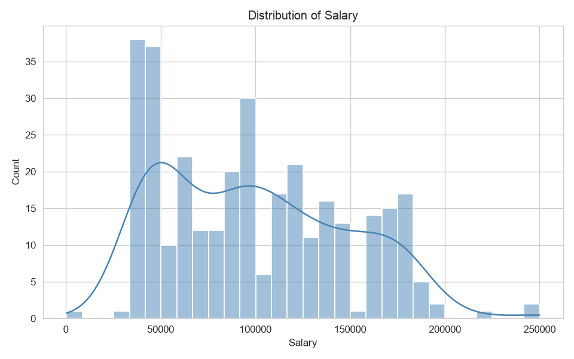
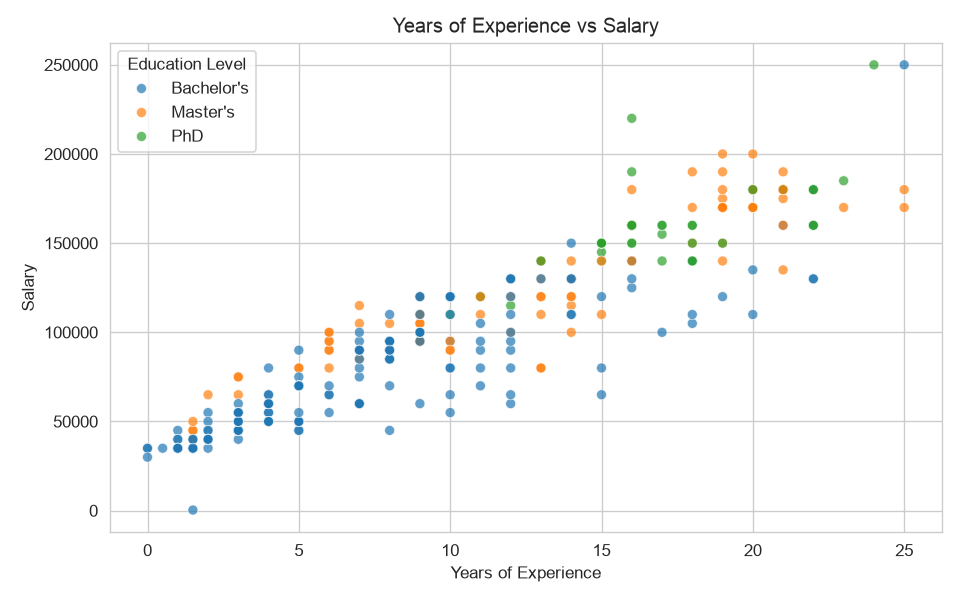
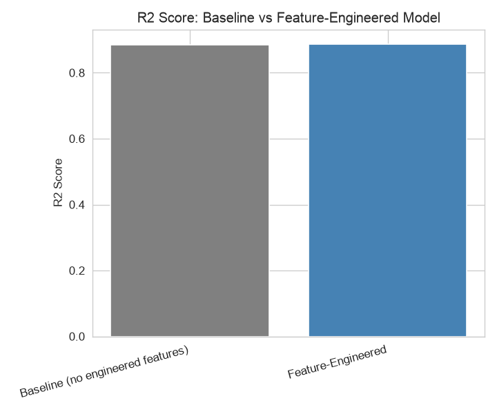
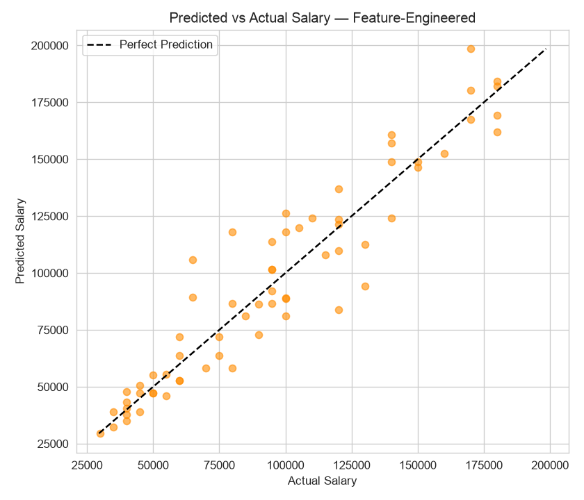

# 💼 Salary Prediction using Age, Education, Job Title & Experience

**HR Analytics Project** :- https://salary-prediction-system-pl.streamlit.app

A Linear Regression model that predicts candidate salary from Age, Gender, Education Level, Job Title, and Years of Experience — built to support consistent, bias-aware compensation decisions during hiring, with a strong focus on feature engineering.


---

## 📌 Problem Statement

An HR analytics team wants to estimate a fair salary for a candidate based on their age, education level, job title, and years of experience.

## 🎯 Business Objective

Predict salary from candidate attributes to support consistent, bias-aware compensation decisions during hiring.

## 🗂️ Dataset

| | |
|---|---|
| **File** | `Dataset/Salary_Data.csv` |
| **Rows (after cleaning)** | 324 (from 375 raw rows) |
| **Columns** | `Age`, `Gender`, `Education Level`, `Job Title`, `Years of Experience`, `Salary` |

## 🔄 Project Workflow

```
Data Collection → Data Cleaning → EDA → Feature Engineering → Model Building → Evaluation → GitHub Docs
```

## 🧹 Data Cleaning

- Dropped rows with missing `Salary` or `Years of Experience`.
- Removed duplicate rows.
- Standardized inconsistent `Education Level` text categories (e.g. variants of "Bachelor's", "Master's", "PhD" mapped to one consistent label each).
- Grouped job titles appearing **fewer than 5 times** into an `Other` category — reducing `Job Title` cardinality from **174 → 12** and avoiding an overly sparse one-hot encoding.

## 📊 Exploratory Data Analysis

| Chart | Preview |
|---|---|
| Distribution of Salary | `Images/01_salary_distribution.png` |
| Avg. Salary by Education Level & Gender | `Images/02_salary_by_education_gender.png` |
| Years of Experience vs Salary | `Images/03_experience_vs_salary.png` |
| Top 10 Highest-Paying Job Titles | `Images/04_top_paying_job_titles.png` |

<p align="center">
  
  
</p>

**Key findings:**
- Salary rises steadily and fairly linearly with Years of Experience.
- PhD and Master's holders earn more on average than Bachelor's holders.
- Senior / Director-level titles dominate the highest-paying roles.
- The average salary gap between genders in this dataset is modest but present.

## 🛠️ Feature Engineering *(Additional Requirement)*

Two new features were engineered on top of the baseline feature set:

1. **`experience_level`** — buckets `Years of Experience` into `Entry` (<3 yrs), `Mid` (3–7 yrs), `Senior` (8+ yrs), one-hot encoded.
2. **`senior_advanced_degree`** — a binary interaction flag = 1 when a candidate is **both** `Senior` **and** holds a Master's/PhD, capturing a compounding salary premium that neither raw feature represents alone.

`Gender`, `Education Level`, and cleaned `Job Title` are one-hot encoded identically for both models so the comparison isolates the effect of the two engineered features.

> **Note:** An `age_experience_ratio` feature (Age ÷ Years of Experience) was also tested but did not improve performance once `Job Title` was already one-hot encoded, so it was excluded — a realistic reminder that not every engineered feature adds value once strong categorical signal already exists in the model.

## 🤖 Model Building

| | |
|---|---|
| **Features (X)** | Age, Years of Experience, one-hot Gender / Education Level / Job Title (+ engineered features for Model 2) |
| **Target (y)** | Salary |
| **Split** | 80/20 train/test, `random_state = 42` (identical for both models) |
| **Model 1** | Baseline Linear Regression |
| **Model 2** | Linear Regression + `experience_level` + `senior_advanced_degree` |

## 📈 Results

| Model | R² | MAE | RMSE |
|---|---|---|---|
| Baseline (no engineered features) | 0.8854 | 11,034.05 | 14,713.57 |
| **Feature-Engineered** | **0.8873** | **10,931.70** | **14,591.53** |

**Improvement from feature engineering:**
- R² ↑ **+0.0019**
- MAE ↓ **102.35**
- RMSE ↓ **122.04**

The feature-engineered model outperforms the baseline on **all three metrics** on the same held-out test set.

<p align="center">
  
  
</p>

Inspecting model coefficients, `experience_level_Senior` carries the largest coefficient magnitude among the engineered terms, followed by `senior_advanced_degree` — the coarse career-stage bucket contributes more than the interaction term, though both help capture non-linear salary progression that raw `Years of Experience` alone misses.

## 📁 Project Structure

```
AIML-Project-RollNo-2302221530074/
├── Dataset/
│   └── Salary_Data.csv
├── Notebook/
│   └── Salary_Prediction.ipynb
├── Images/
│   └── (7 EDA / evaluation charts)
└── README.md
│   
└──  app.py
│   
└── requirement.txt
```

## 🧰 Tech Stack

`pandas` · `numpy` · `matplotlib` · `seaborn` · `scikit-learn` (LinearRegression)

## 📄 License

This project is released under the [MIT License](LICENSE).
